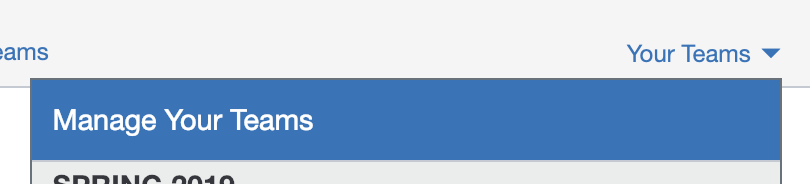
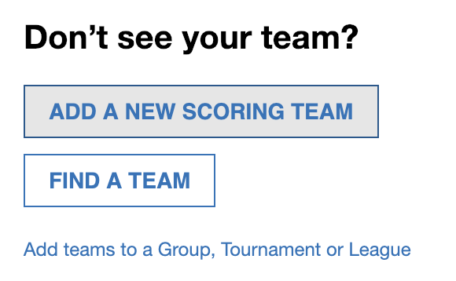
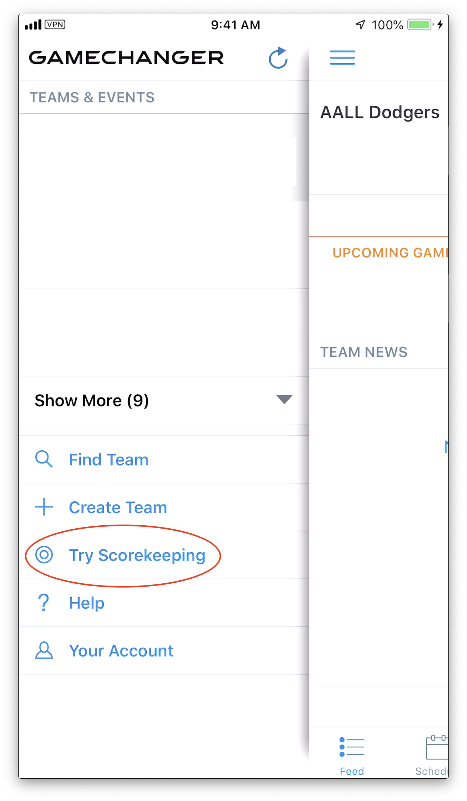

* TOC Stub
{:toc}

# Overview

## What is GameChanger?

GameChanger[^1] is a scorekeeping app for your iPhone that lets you collect and analyze player data throughout the season.

## Is there a cost?

The use of GC is free for up to 4 scorekeepers and coaches per team. Fans of the team can also use the app in a limited capacity (for example, watching play-by-plays of live games). More options are available for purchase from the GC website.

# Team Administration

## How do I add a new team?

1. On the [GC website][gc_com] hit the "Mange Teams" link under the "Your Teams" menu:

    {:class='img-responsive' height='100px'}

2. On the right side of the page hit the "Add a new scoring team" button:

    {:class='img-responsive' height='150px'}

3. Enter in the relevant information about the new team (League, zip code, age range, etc.)

## How do I add team admins?

Team admins include other scorekeepers and coaches. From the [GC website][gc_com], click the "Add coaching staff" button on the lower-right of the page:

{:class='img-responsive' height='150px'}

## How do I add / edit players?

1. From the [GC website][gc_com], click the "Roster and Lineup" tab towards the top of the page:

    {:class='img-responsive' height='100px'}

2. Click the "Add or Edit Players" button towards the bottom-left of the page:

    {:class='img-responsive' height='100px'}

## Can I practice scorekeeping?

There is a "Try Scorekeeping" option from the main menu.

{:class='img-responsive' height='400px'}

# Providing Feedback

If you have questions, comments, or other feedback on this guide, log them as new issues [here](https://github.com/gcguide/gcguide.github.io/issues).

[^1]: GameChanger is abbreviated GC in this document.

[gc_com]: http://gc.com
